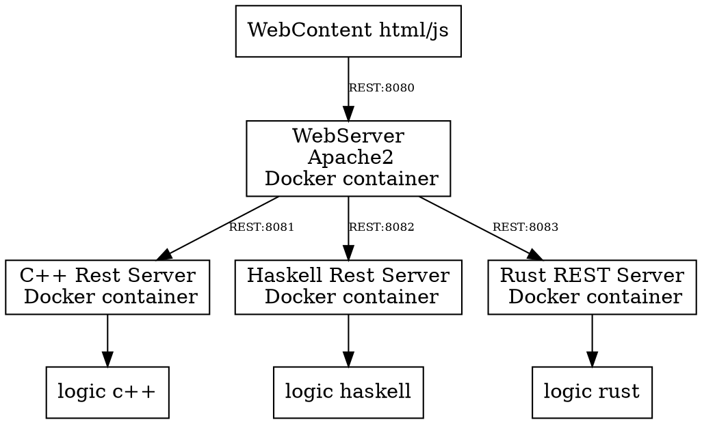

# cc_rust_haskell

## Architecture

[Link to dot Architecture](https://dreampuf.github.io/GraphvizOnline/?engine=dot#digraph%20Arcitecture%20%7B%0A%20%20%20%20node%20%5Bshape%3Dbox%5D%3B%0A%20%20%20%20%22WebContent%20html%2Fjs%22%20-%3E%20%20%22WebServer%5Cn%20Apache2%5Cn%20Docker%20container%22%20%5Blabel%3D%22REST%3A8080%22%2C%20fontsize%3D8%2C%20labeldistance%3D2%5D%3B%0A%20%20%20%20%22WebServer%5Cn%20Apache2%5Cn%20Docker%20container%22%20-%3E%20%22C%2B%2B%20Rest%20Server%5Cn%20Docker%20container%22%20%20%5Blabel%3D%22REST%3A8081%22%2C%20fontsize%3D8%2C%20labeldistance%3D2%5D%3B%0A%20%20%20%20%22C%2B%2B%20Rest%20Server%5Cn%20Docker%20container%22%20-%3E%20%22logic%20c%2B%2B%22%20%0A%20%20%20%20%22WebServer%5Cn%20Apache2%5Cn%20Docker%20container%22%20-%3E%20%22Haskell%20Rest%20Server%5Cn%20Docker%20container%22%20%20%5Blabel%3D%22REST%3A8082%22%2C%20fontsize%3D8%2C%20labeldistance%3D2%5D%0A%20%20%20%20%22Haskell%20Rest%20Server%5Cn%20Docker%20container%22%20-%3E%20%22logic%20haskell%22%0A%20%20%20%20%22WebServer%5Cn%20Apache2%5Cn%20Docker%20container%22%20-%3E%20%22Rust%20REST%20Server%5Cn%20Docker%20container%22%20%5Blabel%3D%22REST%3A8083%22%2C%20fontsize%3D8%2C%20labeldistance%3D2%5D%20%0A%20%20%20%20%22Rust%20REST%20Server%5Cn%20Docker%20container%22%20-%3E%20%22logic%20rust%22%0A%7D)



## Exact sqrt logic

The calculation uses the sum of the odd numbers.
1 + 3 = [4]  
4 + 5 = [4,9]  
9 + 7 = [4,9,16]  
16 + 9 = [4,9,16,25]  
25 + 11 = [4,9,16,25,36]  
36 + 13 = [4,9,16,25,36,49]  

The logic consists of three parts:

A list is created containing radicands and their corresponding square root values.

A simple solution is searched for in this list. If one is found, no further calculation is performed. If not, a complex solution is searched for (multiplicator * sqrt(radicand)).

All radicands from the first list are divided by the given radicand. If a division without remainder exists, a complex solution is found. (Multiple solutions may exist; see the solution for radicand 1000.) If no such division is found, then no solution exists for the radicand.

## Run project with all services

```console
cd cc_rust_haskell
docker compose up
```

## CC

- cmake (Generator Unix Makefiles)
- Restserver htplib

## Build, Run, Test

```console
cmake -B build .
cmake --build build
# run tests
cd build
ctest
# run server
./app/exact_square_root_rest_api_server
```

### Access rest api in container

``` console
curl http://localhost:8081/exactSquareRoot/1000
```

### Build exact-square-root-rest-api-server image

``` console
cd cc/exact-square-root-rest-api-server
docker build -t cc_rest_api_server_sqrt .
```

### Run exact-square-root-rest-api-server container

```console  
cd cc/exact_square_root_rest_api_server
docker run -rm -it -p 8081:8081 cc_rest_api_server_sqrt:latest
```

### develop in VSCode

```console
cd cc
code .
```

## RUST

### Build, Run, Test 

```console
# Build
cargo build
# Build & Run 
cargo run
# Test
cargo test
```

### Access rest api in container

``` console
curl http://localhost:8083/exactSquareRoot/1000
```

### Build exact-square-root-rest-api-server image

``` console
cd rust/exact-square-root-rest-api-server
docker build -t rust_rest_api_server_sqrt .
```

### Run exact-square-root-rest-api-server container

```console  
cd cc/exact_square_root_rest_api_server
docker run -rm -it -p 8081:8081 rust_rest_api_server_sqrt:latest
```

### develop in VSCode

```console
cd rust
code .
```

## HASKELL

### on work

### create project

```console
stack setup
stack templates
stack new hello_world
```

### haskell rest api

```console
curl http://localhost:8082/exactSquareRoot/
```

### start docker rest api server haskell (exact square root)

```console
# go to project
cd haskell/exact-square-root-rest-api-server
# create image
docker build -t image_haskell_exact_square_root_rest_api_server .
# for test run container in bash
docker run -it -v $(pwd):/app image_haskell_exact_square_root_rest_api_server:latest bash
# run container with publish port 8082 and run rest api server
# first time
docker run -it --name haskell_exact_square_root_rest_api_server -p 8082:8082 -v $(pwd):/app image_haskell_exact_square_root_rest_api_server /app/start.sh
# start container next time
docker start -i haskell_exact_square_root_rest_api_server
# stop container 
docker stop haskell_exact_square_root_rest_api_server
```

## multistage image

```console
docker build -t haskell_rest_api_server_sqrt .
docker run -it -p 8082:8082 haskell_rest_api_server_sqrt:latest /app/exact-square-root-rest-api-server-exe
```

## WEB CLIENT

### apache container

```console
docker build -t my-apache2 .
docker run -it --name my-running-app -p 8080:80 my-apache2
```