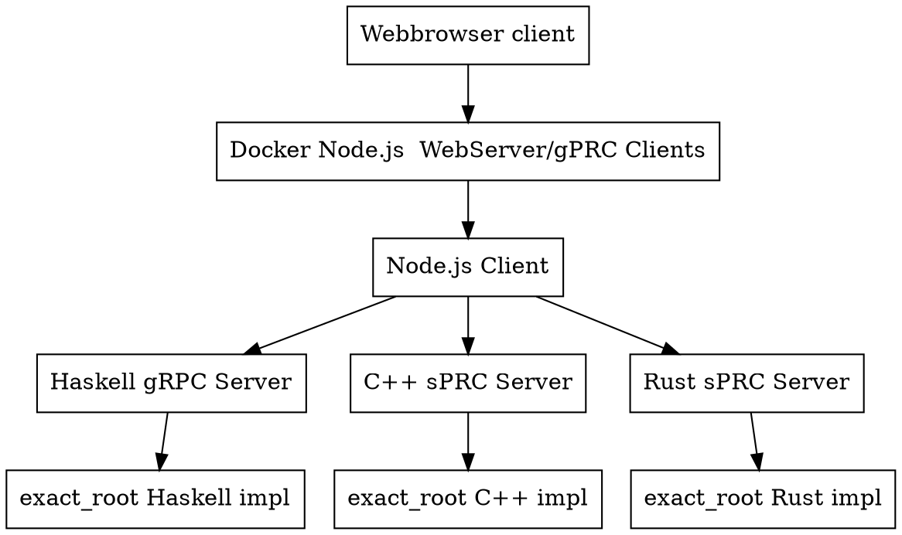

# cc_rust_haskell

## TODO
- [x] create uWebSocket in c++
- [x] create websocket_html_js_client
- [ ] create helo world shared object in c++, rust and haskell
- [ ] *.so aufgeben da im Haskell eine Haskell Environment in CMake integriert werden soll
- [ ] auf gRPC umstellen, Opensorce
- [ ] for c++, haskell, rust eigenen container erstellen
- [ ] composer, welcher alle container startet und die Projekte compeliert.
- [ ] eine Node.js server austellen, welcher die Anfragen an der Richtigen Container sendet.

## Architecture

[Link to dot Architecture](https://dreampuf.github.io/GraphvizOnline/?engine=dot#digraph%20Arcitecture%20%7B%0A%20%20%20%20node%20%5Bshape%3Dbox%5D%3B%0A%20%20%20%20%22Webbrowser%20client%22%20-%3E%20%22Docker%20Node.js%20%20WebServer%2FgPRC%20Clients%22%0A%20%20%20%20%22Docker%20Node.js%20%20WebServer%2FgPRC%20Clients%22%20-%3E%20%22Node.js%20Client%22%20-%3E%20%0A%20%20%20%20%22Haskell%20gRPC%20Server%22%20-%3E%20%22exact_root%20Haskell%20impl%22%0A%20%20%20%20%22Node.js%20Client%22%20-%3E%20%22C%2B%2B%20sPRC%20Server%22%20-%3E%20%22exact_root%20C%2B%2B%20impl%22%0A%20%20%20%20%22Node.js%20Client%22%20-%3E%20%22Rust%20sPRC%20Server%22%20-%3E%20%22exact_root%20Rust%20impl%22%0A%7D)



## cc
- create project dir
- crate CMakeLists.txt
```
cmake_minimum_required(VERSION 3.15)

# Project name
project(hello_word)

# C++ standard
set(CMAKE_CXX_STANDARD 17)
set(CMAKE_CXX_STANDARD_REQUIRED ON)

# Add the executable
add_executable(hello_word
    src/main.cpp
)
```
- create main.cc in src
```
#include <iostream>

int main() {
    std::cout << "Hello World!" << std::endl;
    return 0;
}
```
- run cmake
```
cd build
cmake ..
cmake --build .
```

## rust
```
cargo new hello_world
cargo run
```

## haskell
```
stack setup
stack templates
stack new hello_world
``` 
- generate so
```
mkdir dist && stack ghc -- -dynamic -shared -fPIC -o dist/libexactroot.so -odir dist -hidir dist -stubdir dist/include src/ExactRootFFI.hs src/ExactRoot.hs
```

### uWebsockets
```
git clone https://github.com/flipkickmedia/uwebsockets-cmake.git

cmake -S . -B build -DCMAKE_BUILD_TYPE=Release
cmake --build build -j
```

### proto
```console
apt install -y protobuf-compiler
```

### proto haskell
```console
stack install proto-lens-protoc
```
- im Projekt
```console
protoc --plugin=protoc-gen-haskell=$(stack exec -- which proto-lens-protoc)  --haskell_out=src proto/hello_world.proto
```

### rest
``` console
curl http://localhost:8080/health
curl -X POST http://localhost:8080/items -H "Content-Type: application/json" -d '{"name":"Widget","price":12.5}'
curl http://localhost:8080/items/1

```

### apache container
```console
docker build -t my-apache2 .
docker run -dit --name my-running-app -p 8080:80 my-apache2
```

## docker 

```console

docker build -t example_restapi_json_server .
docker run -it -v $(pwd):/app example_restapi_json_server bash
docker run -it -p 8080:8080 -v $(pwd):/app example_restapi_json_server /app/start_rest_api_json_server.sh

```
